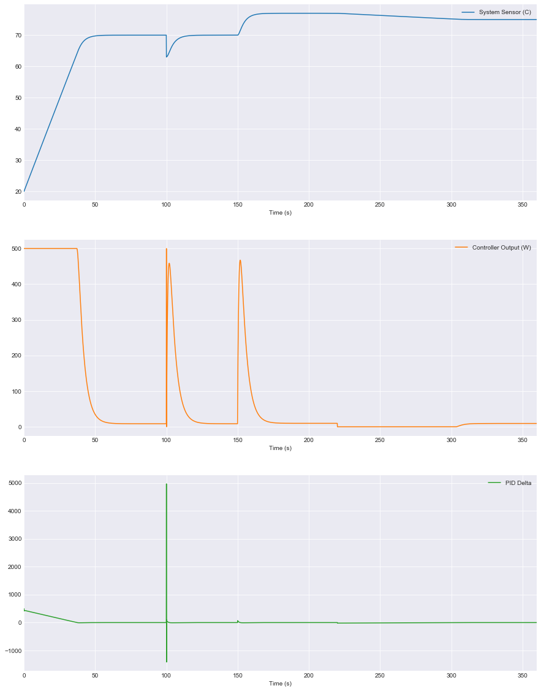

# EPID - Embedded Proportional-Integral-Derivative (PID) controller

Testing the C library **EPID v1.0.0** by simulation of heating 100g of grams of water by variable RMS ohmic heating.

---

Portable implementation of "Type-C PID controller"[*] for both hosted
and freestanding C environments with a flexible API that allow the usage of
third-party external and/or internal filter(s) for a better control
backed with errors and exceptions handling.

\[\*\]: D. M. Auslander, Y. Takahashi and M. Tomizuka, "Direct digital process
control: Practice and algorithms for microprocessor application,"
in Proceedings of the IEEE, vol. 66, no. 2, pp. 199-208, Feb. 1978,
doi: 10.1109/PROC.1978.10870.

### Test parameters:
- Controller (PI/PID): PID.
- Kp gain: 500
- Ki gain: 10
- Kd gain: 200
- Sample period: 0.1s
- Deadband: 0 (Off)
- PID output min: 0
- PID output max: 500
- Heater max power in Watts: 500
- simulation time: 360s (6min)
- No I-term anti-windup, No D-term noise filter.
---


```python
import os
import pandas as pd
import matplotlib.pyplot as plt
# For Jupyter notebook, include:
%matplotlib inline
```


```python
os.system("gcc -std=c99 -O2 -Wall -Wextra -pedantic main.c -lm -o pid.bin") # Compile the test source-code
os.system("./pid.bin > pid.csv 2>&1") # Execute and save the output as an CSV file.

df = pd.read_csv("pid.csv", delimiter="\t") # Load the CSV output data
df.describe() # Show various statistics
```


<div>
<style scoped>
    .dataframe tbody tr th:only-of-type {
        vertical-align: middle;
    }

    .dataframe tbody tr th {
        vertical-align: top;
    }

    .dataframe thead th {
        text-align: right;
    }
</style>
<table border="1" class="dataframe">
  <thead>
    <tr style="text-align: right;">
      <th></th>
      <th>Time (s)</th>
      <th>System Sensor (C)</th>
      <th>Controller Output (W)</th>
      <th>PID Delta</th>
    </tr>
  </thead>
  <tbody>
    <tr>
      <th>count</th>
      <td>3600.000000</td>
      <td>3600.000000</td>
      <td>3600.000000</td>
      <td>3600.000000</td>
    </tr>
    <tr>
      <th>mean</th>
      <td>179.950000</td>
      <td>70.395912</td>
      <td>80.635134</td>
      <td>21.457541</td>
    </tr>
    <tr>
      <th>std</th>
      <td>103.937481</td>
      <td>10.910576</td>
      <td>162.802435</td>
      <td>117.007370</td>
    </tr>
    <tr>
      <th>min</th>
      <td>0.000000</td>
      <td>20.000000</td>
      <td>0.000000</td>
      <td>-1413.571533</td>
    </tr>
    <tr>
      <th>25%</th>
      <td>89.975000</td>
      <td>69.990005</td>
      <td>7.015190</td>
      <td>-2.861691</td>
    </tr>
    <tr>
      <th>50%</th>
      <td>179.950000</td>
      <td>75.000038</td>
      <td>9.308929</td>
      <td>-0.005073</td>
    </tr>
    <tr>
      <th>75%</th>
      <td>269.925000</td>
      <td>76.304813</td>
      <td>19.044041</td>
      <td>0.000305</td>
    </tr>
    <tr>
      <th>max</th>
      <td>359.900000</td>
      <td>77.000000</td>
      <td>500.000000</td>
      <td>4970.000000</td>
    </tr>
  </tbody>
</table>
</div>


---
<!---
# Delete first X-sec from time
to_delete = 0
sample_period = 0.1
from math import floor as floor
df = df.iloc[floor(to_delete/sample_period):]
-->


```python
# Plot:
# f(t)="System Sensor (C)", g(t)="Controller Output (W)", d(t)="PID Delta"

plt.style.use('seaborn-darkgrid')
ax = df.plot(x="Time (s)", kind='line', subplots=True, 
             linewidth=1.5, grid=True, sharex=False, figsize=(15, 20))
```





- **T=0s**:   Command heating from *20°C* to *70°C*.
- **T=100s**: Simulate putting cold water in the hot container (heat go down by 7°C*).
- **T=150s**: Simulate higher setpoint change to *77°C*.
- **T=220s**: Simulate lower setpoint change to *75°C*.

*2020-08-14*

---
