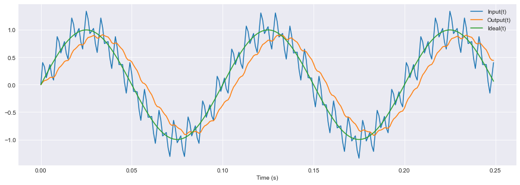

# EPID - Embedded Proportional-Integral-Derivative (PID) controller

Testing the C library **EPID v1** low-pass filter functions.

---

### Test parameters:
- Filter type: 1st order IIR low-pass filter.
- Sample period: 0.001 s
- Samples count: 250
- Signal frequency: 10 Hz
- Signal noise frequency: 250 Hz
- Filter cutoff frequency: 20 Hz
- simulation time: ~ 0.25s

---


```python
import os
import pandas as pd
import matplotlib.pyplot as plt
# For Jupyter notebook, include:
%matplotlib inline
```


```python
os.system("gcc -std=c99 -O2 -Wall -Wextra -pedantic test_lpf.c -lm -o test_lpf.bin") # Compile the test source-code
os.system("./test_lpf.bin > test_lpf.csv 2>&1") # Execute and save the output as an CSV file.

df = pd.read_csv("test_lpf.csv", delimiter="\t") # Load the CSV output data
#df.describe() # Show various statistics
```

---
<!---
# Delete first X-sec from time
to_delete = 0
sample_period = 0.1
from math import floor as floor
df = df.iloc[floor(to_delete/sample_period):]
-->


```python
# Plot:
# f(t)="System Sensor (C)", g(t)="Controller Output (W)", d(t)="PID Delta"

plt.style.use('seaborn-darkgrid')
ax = df.plot(x="Time (s)", kind='line', subplots=False, 
             linewidth=1.5, grid=True, figsize=(15, 5))
```





*2020-08-29*

---
